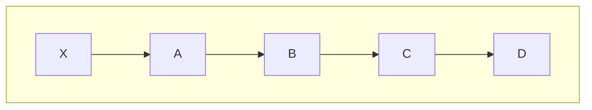
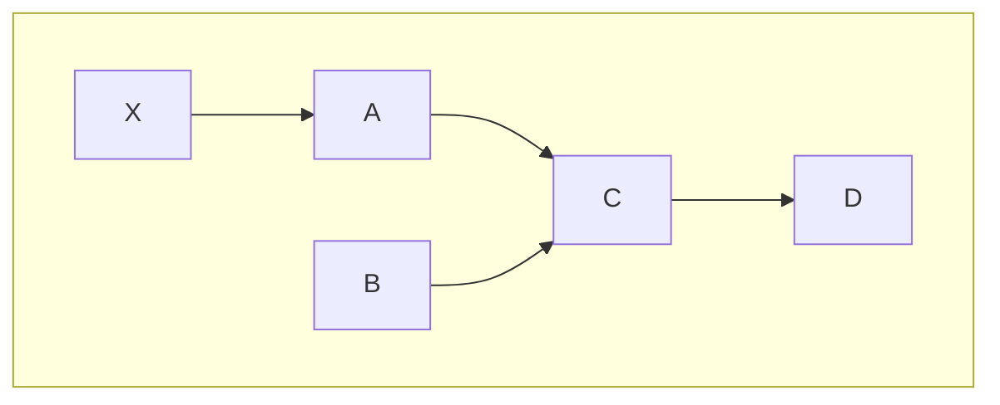

**Linked list** це структура даних, в якій кожен елемент зберігає посилання на наступний

Через це елементи в linked list можуть знаходитись будь-де!

![[Linked list in memory without links example.png]]

![[Linked list in memory with links.png]]

> [!tldr] Приклад з пошуком скарбів або грою
> 
> Ми можемо думати про зв'язаний список як про гру в якій, щоб добратись кудись нам треба пройти рівень, після якого ми йдемо на наступний рівень, після на наступний і так далі
> 
> Або ж як пошук скарбів по мапі

Таблиця швидкостей базових операцій, та порівняння з [[Array]]:

![[Arrays and Linked list Big O.png]]

### Додавання елементів

У **Linked list** є одна чудова риса - в них дуже просто додавати елементи!

Якщо ми хочемо додати якийсь елемент в кінець, все що нам потрібно, так це додати його кудись в пам'ять, а останньому елементу сказати що наступний той, який ми створили

З Linked list нам ніколи не треба буде переміщувати елементи, оскільки вони завжди будуть поміщатись правильно, на відміну від [[Array]]

Тому додавання нових елементів в Linked list займає [[O(1)]], але тільки при умові, що у нас вже є доступ до останього елемента

Зазвичай при використанні Linked list зберігають початок та кінець, для швидкості

### Проблема зв'язаних списків в читанні інформації

Linked list виглядають дуже гарно, але у них є одна велика проблема - читання інформації

Оскільки елементи зберігаються не в одному місці, щоб знайти якийсь елемент, навіть якщо ми знаємо його індекс, нам треба проходитись по всім! Це називається [[Sequential access]]

І це дуже велика проблема, оскільки такий пошук займає [[O(n)]]!

> [!danger]
> 
> **Linked list** краще не використовувати, коли треба часто читати окремі елементи
> 
> Якщо є така ситуація, то краще взяти іншу структуру даних. Наприклад, [[Array]] які не мають цих проблем

Але при цьому, **Linked list** гарно підходять, коли нам не потрібно знаходити окремі елементи й ми читаємо всі відразу

### Видалення елементів

Щоб видалити елемент з Linked list потрібно [[O(1)]]

Все, що нам потрібно, це замінити посилання попереднього елемента, до того, який ми хочемо видалити на наступний, після елемента, який ми хочемо видалити

Тобто, спочатку наш Linked list виглядає ось так:

А після видалення, наприклад `B`, ось так:

Тому видалення елементів з **Linked list**, якщо ми маємо прямий доступ до попереднього елемента займає [[O(1)]]

Якщо не маємо, то його треба знайти, а це [[O(n)]]