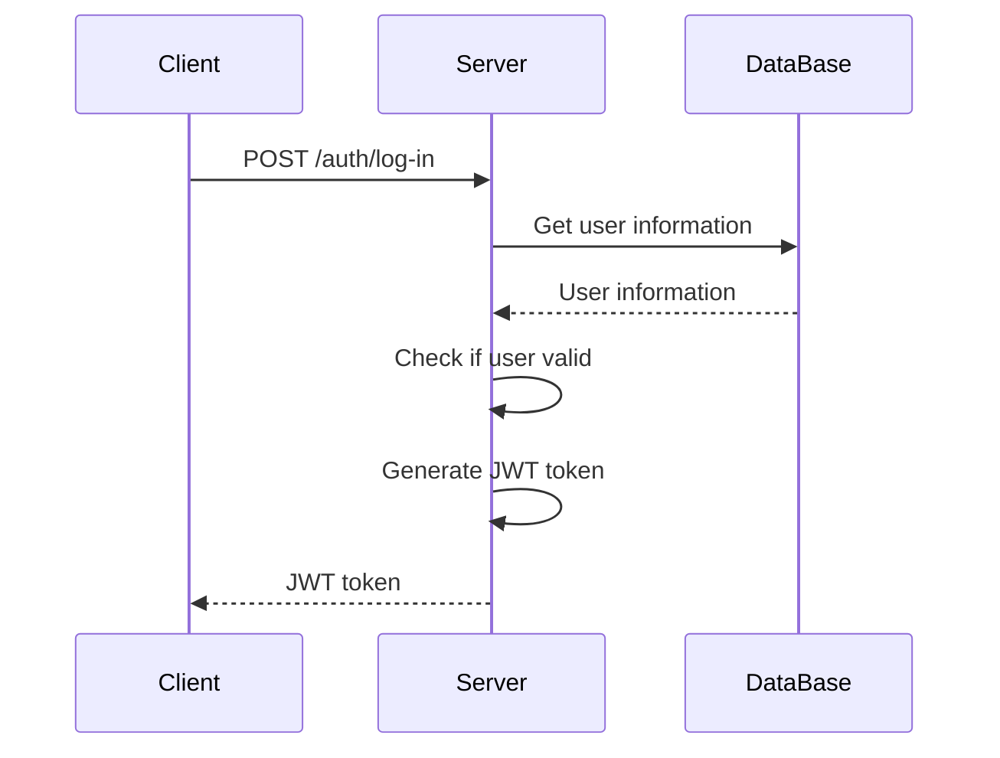
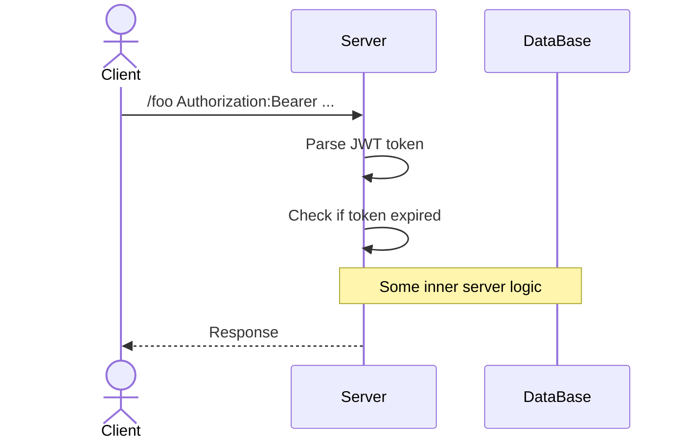

### Створення токену

Наприклад, у нас є деякий запит на авторизацію від клієнта

Коли нам приходить такий запит, сервер дістає дані користувача з бази даних, а після генерує JWT токен, який містить всю необхідну інформацію про цього клієнта, а далі цей токен відправляється клієнту

Це буде виглядати якось ось так:

### Використання токена

Коли користувач робить запит на якийсь endpoint він завжди передає цей токен тим чи іншим шляхом

Зазвичай використовується або Authorization header, або ж cookies

Після отримання запиту наш сервер спочатку перевіряє підпис токена, щоб бути впевненим, що це наш токен

А далі вже парсить дані токена та перевіряє інформацію, яка йому потрібна

На цьому моменті наш сервер впевнений, що це наш токен, що він валідний та ми можемо довіряти його даним

І тут показується головна перевага над [[Сесії|сесіями]] - нам не потрібно робити запити до бази даних, щоб дізнатись чи [[Authentication|Аутентифікований]] користувач, оскільки у нас є токен!

Щодо [[Authorization|Авторизації]] - ми можемо прямо в токен написати потрібну нам інформацію. Наприклад, ми можемо в токені написати тип акаунту користувача, чи є у нього преміум тощо

### Плюси авторизації через JWT

#### 

### Мінуси авторизації через JWT

#### Ми не можемо відкликати токени відразу

Щоб відкликати токен в [[Сесії|Сесіях]] ми можемо просто видалити її й все

У JWT це так не працює, фактично ми не можемо його відкликати після того, як випустили

_// TODO: Move to Refresh_
Для розв'язання цієї проблеми використовують підхід не з одним, а відразу з двома токенами

Перший, його називають `Access`, це токен який відправляє користувач нам та через який ми робимо авторизації

А другий це `Refresh`. Цей токен зберігається на сервері та через нього ми перестворюємо `Access`

Сенс в тому, що `Access` живе невелику кількість часу, наприклад 5 - 15 хвилин. І коли він expired ми відправляємо запит на сервер, щоб отримати новий access токен

Детальніше - [[Refresh token]]