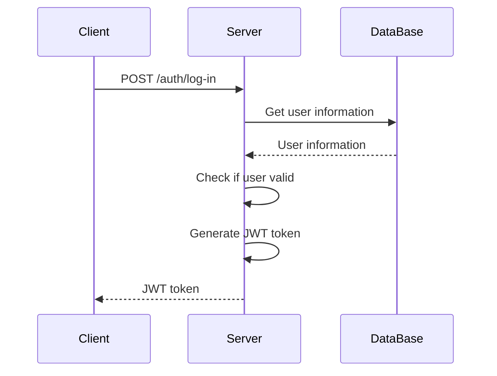
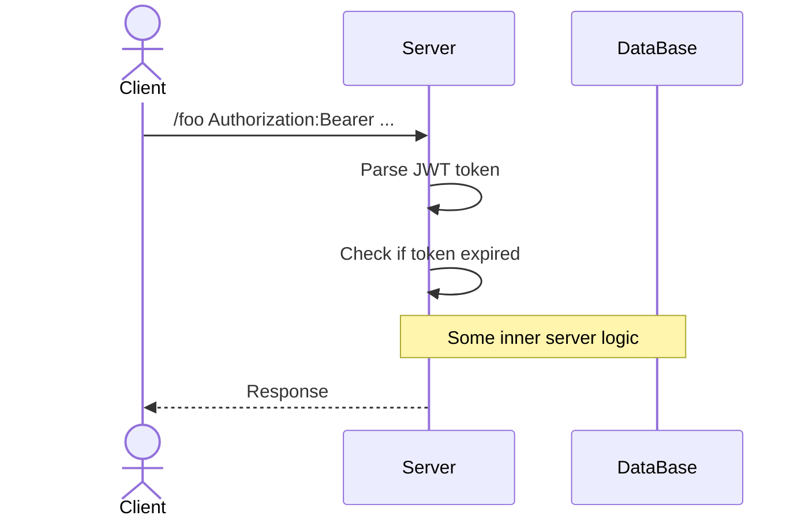

Наприклад, у нас є деякий запит на авторизацію від клієнта

Коли нам приходить такий запит, сервер дістає дані користувача з бази даних, а після генерує JWT токен, який містить всю необхідну інформацію про цього клієнта, а далі цей токен відправляється клієнту

Тобто це буде виглядати якось ось так:

Далі, коли користувач робить запит на якийсь endpoint наш сервер парсить дані токена й може зрозуміти чи цей користувач авторизований

Тобто, нам не потрібно робити ніяких додаткових запитів до баз даних як це відбувається з [[Сесії|сесіями]], оскільки всі дані відразу записані в токені!

Єдине запитання яке є - чи можемо ми довіряти цьому токену?

І відповідь так! Оскільки щоб створити токен ми використовуємо **private** ключ, а щоб дістати інформацію з JWT використовуємо **public**. Детальніше - [[Json Web Token#Public та private ключі]]