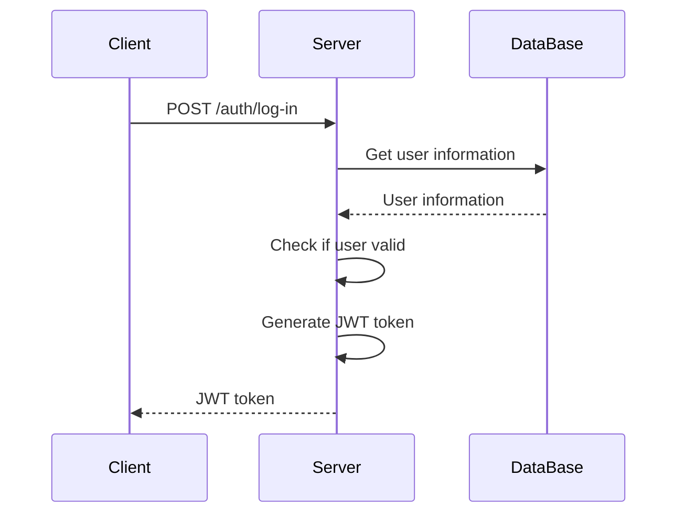
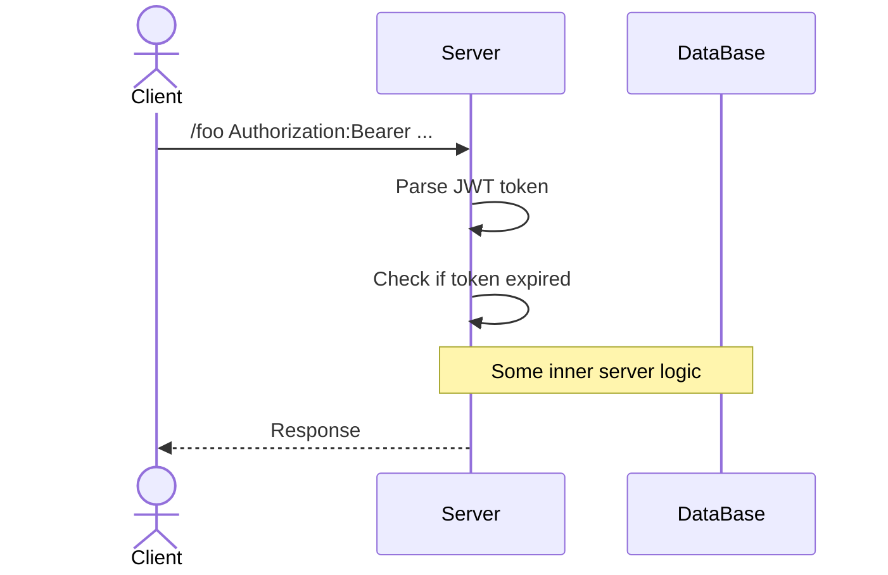

**Json Web Token** - це стандарт для створення даних з опціональною сигнатурою (підписом) та/або опціональним шифруванням 

JWT читаються як `jot`

JWT являють собою строку, яка складається з трьох елементів розділених точками:
- `header` - Це заголовки токена. Наприклад, інформація про expired, алгоритм шифрування, хто випустив токен тощо
- `payload` - Це контент токена. Ми можемо сюди написати що завгодно
- `signature` - Криптографічний підпис, який залежить від заголовка та даних

### Public та private ключі

Для створення JWT використовується [[Асинхронна криптографія]]

Тобто насправді у нас не один ключ, а цілих два!

Ці ключі є парою

Якщо ми зашифрували щось використовуючи ключ `A`, то розшифрувати ми можемо цю інформацію тільки використовуючи ключ `B`

І також це працює у зворотному напрямку. Якщо ми щось зашифрували використовуючи ключ `B`, то нам треба ключ `A`, щоб це розшифрувати

Зазвичай такі ключі називають `private` та `public`, при цьому не важливо який саме який

Private ключ потрібно зберігати як зіницю ока, це ключ використовуючи який ми створюємо JWT токени!

А public ключ ми можемо роздати кому завгодно, буквально(наприклад, [public ключі github](https://github.com/xanf.keys)), або ж навіть намалювати його на заборі. Цей ключ використовується тільки для читання та перевірки даних

Тобто, перевіряючи JWT токен public ключем ми можемо бути впевненими, що він створений його парним private ключем

### Авторизація через JWT

Наприклад, у нас є деякий запит на авторизацію від клієнта

Коли нам приходить такий запит, сервер дістає дані користувача з бази даних, а після генерує JWT токен, який містить всю необхідну інформацію про цього клієнта, а далі цей токен відправляється клієнту

Тобто це буде виглядати якось ось так:

Далі, коли користувач робить запит на якийсь endpoint наш сервер парсить дані токена й може зрозуміти чи цей користувач авторизований

Тобто, нам не потрібно робити ніяких додаткових запитів до баз даних як це відбувається з [[Сесії|сесіями]], оскільки всі дані відразу записані в токені!

Єдине запитання яке є - чи можемо ми довіряти цьому токену?

І відповідь так! Оскільки щоб створити токен ми використовуємо **private** ключ, а щоб дістати інформацію з JWT використовуємо **public**. Детальніше - [[JWT#Public та private ключі]]