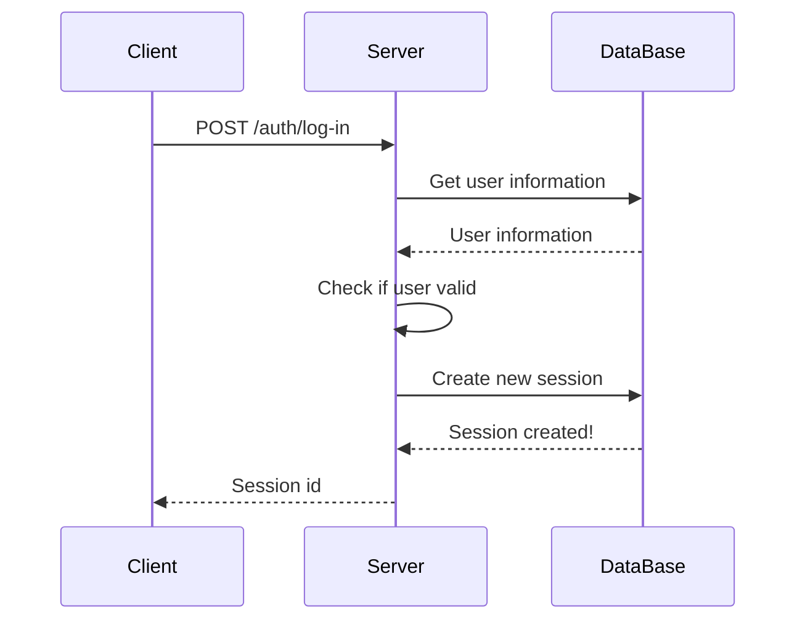
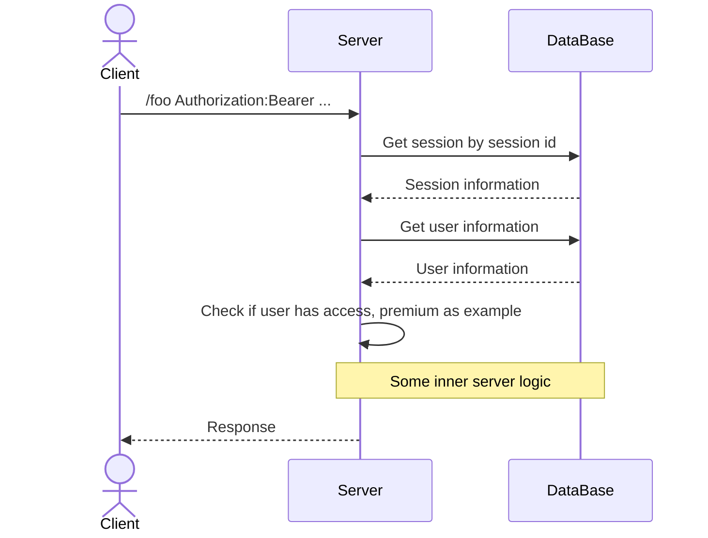

**Сесії** - це один з базових та досить простих способів [[Authentication|аутентифікації]] та [[Authorization|авторизації]] користувачів на деякій платформі

### Як працюють сесії?

Наприклад, у нас є деякий запит на авторизацію від клієнта

Для початку сервер повинен знайти користувача по цім даним в базі та перевірити чи все з ним правильно

Якщо все добре, то сервер створює нову сесію для цього користувача та записує її в деяке загальне сховище

В більшості випадків це база даних, але може бути й інше загальне сховище, наприклад Redis

Після цього сервер деяким чином передає ці дані клієнтові, через cookies чи через відповідь не важливо

Загальна діаграма буде виглядати якось ось так:

Далі коли клієнт робить якийсь інший запит, то він завжди передає цей ідентифікатор сесії на сервер

Коли такий запит приходить, сервер перевіряє чи сесія існує, перевіряє її на валідність тощо

Якщо все добре - це значить, що користувач авторизований та йому можна надавати доступ до нашої платформи

### Плюси сесій

#### Можливість їх відкликання

Першим плюсом сесій є **можливість їх відкликання**

Тобто, коли користувач змінить пароль, або ж захоче видалити всі активні сесії(як це можна зробити, наприклад, в Telegram), то ми це можемо зробити просто видаливши сесію

Таким чином, всі наступні запити після видалення не пройдуть

#### Можливість встановлювати ліміти

Другий плюс - можливість встановлювати ліміти на кількість сесій

Наприклад, ми **Netflix** та ми не хочемо, щоб користувач мав змогу авторизуватись одночасно з деякої кількості пристроїв

Оскільки сесії зберігаються на сервері ми можемо дуже просто відстежувати їх кількість

#### Простота

Сесії - простий механізм, а це означає, що у нас менше шансів помилитись при їх реалізації

Чим менше у нас шансів помилитись - тим менше у нас багів, і тим менше у нас буде проблем

### Мінуси сесій

#### Додатковий запит до сховиша інформації

Головним мінусом сесій є додатковий запит до сховища інформації

Кожен запит до такого сховища - це час, тобто затримки для користувачів

Ще більшою проблемою це стає, коли у нас мікросервіси й кожен мікросервіс повинен перевіряти, чи користувач авторизований

І також важливо розуміти, що запит до сховища з сесіями вирішує тільки проблему [[Authentication]], а для авторизації треба робити додатковий запит до основного сховища, щоб перевірити, чи є у користувача доступи

Якщо ми будуємо надшвидкісні системи - то з цим будуть проблеми

#### Проблема з авторизацією на інших серверах

Якщо у нас мікросервісна архітектура, то нам потрібно щоб кожен окремий сервіс мав доступ і до сховища з сесіями, і до великого сховища даних, щоб провести [[Authentication]] та [[Authorization]]

Це не дуже приємно, але не критично

Критично, це коли ми хочемо, щоб інші сервіси мали можливість перевірити чи конкретний користувач має доступ до нашої платформи

Ми не хочемо давати доступ сторонньому сервісу до нашої бази даних

Для цього нам потрібно вигадувати якийсь функціонал, наприклад, окремий endpoint на який буде стукатись сервіс та запитувати нас

#### Проблема з авторизацією через зовнішні сервери

Представимо ситуацію, що ми вирішили не робити авторизацію вручну, а використати якийсь зовнішній сервіс для цього

Оскільки сесії зберігаються у нас локально, нам, знову таки, потрібно думати над тим, як їх створювати коли користувач авторизувався на стороньому сервісі

---
## Reference

"Сесії проти JWT #1: Що обрати?" від [[JavaScript Січ]]: https://youtu.be/Zk9drnLo590

