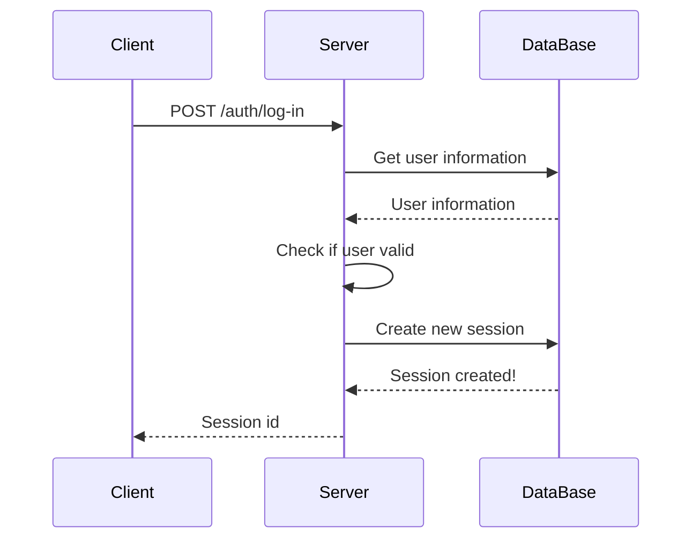
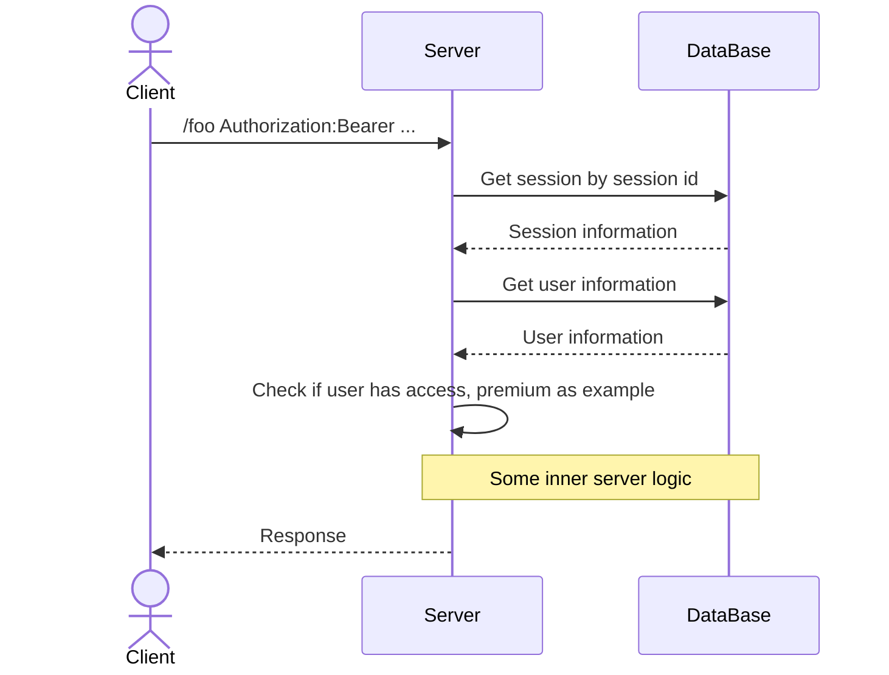

**Сесії** - це один з базових та досить простих способів авторизації користувачів на деякій платформі

### Як працюють сесії?

Наприклад, у нас є деякий запит на авторизацію від клієнта

Для початку сервер повинен знайти користувача по цім даним в базі та перевірити чи все з ним правильно

Якщо все добре, то сервер створює нову сесію для цього користувача та записує її в деяке загальне сховище, в більшості випадків це база даних

Після цього сервер деяким чином передає ці дані клієнтові, через cookies чи через відповідь не важливо

Тобто це буде виглядати якось ось так:

Далі коли клієнт робить якийсь інший запит, то він завжди передає цей ідентифікатор сесії на сервер

Коли такий запит приходить, сервер перевіряє чи сесія існує, перевіряє її на валідність і так далі

Якщо все добре - це значить, що користувач авторизований та йому можна надавати доступ до нашої платформи

### Плюси та мінуси сесій

Плюси:

✅ Можливість відкликання сесії
✅ Ліміти сесій. Наприклад, Netflix
✅ Простота та обмеженість

Мінуси:

❌ Додатковий запит до сховища
❌ Проблема з авторизацією на інших(своїх та сторонніх) серверах
❌ Проблема з зовнішньою авторизацією

